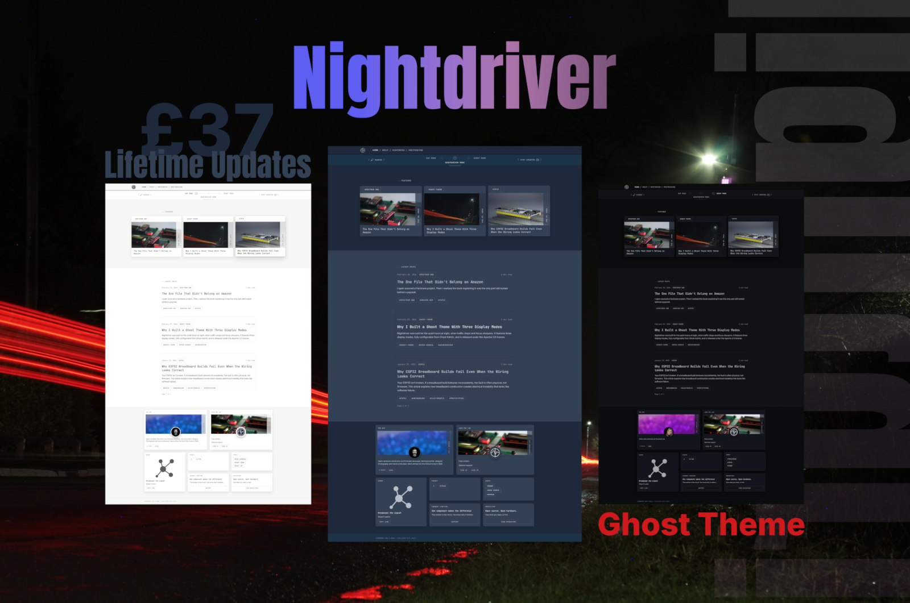

# Nightdriver

  

Nightdriver is a high-control, performance-focused Ghost theme for creators who value precision and clarity—built for focused reading and long-form publishing, with three display modes and 20 configurable settings managed directly in Ghost Admin.

**Demo:** <https://currenari.com>

**Version:** 1.2.0  
**Changelog:** See `CHANGELOG.md`

---

## Highlights

- Three display modes: Day, Nightdriver (Custom), Night
- Collapsible utility bar (scroll-aware) with pin/unpin on long-press
- Bento-style Drift Zone section on the homepage
- Signal Notes strip powered by posts tagged `note`
- Layby mixed-media section powered by posts tagged `layby`, including YouTube poster cards
- Featured posts grid and latest posts list with `Single` / `Double` layout option
- Post video embeds: lead presentation for first video, compact inline for additional videos (desktop)
- Optional reading progress bar on posts
- Local fonts bundled (Inter, JetBrains Mono)
- Custom SVG icon sprite, no third-party dependencies
- Koenig editor buttons styled to match the theme

---

## Requirements

Ghost 5.0.0 or higher.

---

## Installation

1. Download the theme `.zip`
2. Go to Ghost Admin > Settings > Design > Change theme > Upload theme
3. Activate

---

## Configuration

All settings are accessed via Ghost Admin > Settings > Site - Design & branding > Customize > Theme.

### Snipcart

| Setting | Default |
|---------|---------|
| `snipcart_public_api_key` | (empty) |

Set this in Ghost Admin: `Settings → Design → Customize`.

### Reading Progress Bar

| Setting | Default |
|---------|---------|
| `progress_bar_color` | `#0ea5e9` |
| `progress_track_color` | `#1a1a1a` |
| `progress_bar_height` | `2px` (can be turned off) |
| `latest_posts_layout` | `Single` (`Single` / `Double`) |

### Signal Notes Style

| Setting | Default |
|---------|---------|
| `signal_notes_gradient_tint` | `#6b7280` |

### Custom Mode Colours

These control the appearance of the middle "Nightdriver" mode.

**Backgrounds**

| Setting | Default |
|---------|---------|
| `nightdriver_custom_mode_background` | `#1e293b` |
| `nightdriver_custom_mode_surface` | `#334155` |
| `nightdriver_custom_mode_header_utility_bg` | `#1d3348` |
| `nightdriver_custom_mode_footer_bg` | `#0f172a` |
| `nightdriver_custom_mode_ui_spacer_bg` | `#1e293b` |

**Text**

| Setting | Default |
|---------|---------|
| `nightdriver_custom_mode_text` | `#f1f5f9` |
| `nightdriver_custom_mode_text_secondary` | `#cbd5e1` |
| `nightdriver_custom_mode_text_tertiary` | `#94a3b8` |

**Borders**

| Setting | Default |
|---------|---------|
| `nightdriver_custom_mode_border` | `#475569` |

### Mode Labels

| Setting | Default |
|---------|---------|
| `mode_labels` | `DAY MODE\|NIGHTDRIVER MODE\|NIGHT MODE` |

Use the pipe character `|` as a separator between labels. The format must follow one of these patterns:

`NAME ONE|NAME TWO|NAME THREE` or `NAMEONE|NAMETWO|NAMETHREE`

Incorrect formatting will break the theme.

### Portal CTA

| Setting | Default |
|---------|---------|
| `portal_cta_heading` | `Stay Updated` |
| `portal_cta_subtext_line1` | `Get new posts by email.` |
| `portal_cta_brand_text` | `Thoughts, stories and ideas.` |

### Footer

| Setting | Default | Options |
|---------|---------|---------|
| `show_footer_copyright` | `true` | `true` (visible) / `false` (hidden) |

---

## Features

### Utility Bar

The utility bar auto-hides on scroll down and reappears on scroll up. Tap the handle to toggle. Long-press to pin (prevents auto-hide). Keyboard accessible via Enter/Space.

### Navigation

**Primary:** Ghost Admin > Settings > Navigation (Primary)

**Secondary:** Ghost Admin > Settings > Navigation (Secondary). Rendered as plain text links. Used in Drift Zone and footer.

### Drift Zone

The bento-style homepage section. Located in `partials/content/drift-zone.hbs`. Contains dynamic tiles (authors, tags, secondary nav, Portal CTA) and static tiles (support, repository). Edit the partial to customise static content.

### Signal Notes

Use normal Ghost posts for notes:

1. Create a post in Ghost Admin
2. Add the tag `note`
3. Publish

The homepage auto-displays the latest 3 published posts with tag `note` in the Signal Notes strip.
Posts tagged `note` are excluded from the homepage Latest Posts list.

### Layby

Use normal Ghost posts for mixed media entries:

1. Create a post in Ghost Admin
2. Add the tag `layby`
3. Publish

The homepage auto-displays the latest 6 published posts tagged `layby` in an adaptive grid:
`1` centered, `2` columns for `2` posts, `3` columns for `3`, `2x2` for `4`, `3+2` for `5`, and `3x2` for `6`.
Posts tagged `layby` are excluded from the homepage Latest Posts list.
YouTube embeds in Layby are rendered as poster cards (thumbnail, title label, play badge) and open on YouTube when clicked.

### Post Video Embeds

On single post pages, the first video embed is rendered as lead media, and any additional video embeds are rendered in a compact inline width on desktop. On mobile, embeds render full width.

### Products Page

1. Create a page with slug `products`
2. Tag product pages with `product`
3. Use the `page-products.hbs` template for a product index page
4. The products page will list all pages with that tag

### Author Pages

Minimal by design. Pulls name, bio, location, website, and social links from Ghost's author profile. For a custom profile page, build it as a standard Ghost page and link to it.

---

## Browser Support

Modern evergreen browsers: Chrome, Firefox, Safari, Edge.

---

## Maintenance QA

Before packaging the theme:

1. Run `npm run validate:custom` to verify every referenced `@custom.*` usage is declared in `package.json` (unused declared settings are reported but allowed).
2. Verify homepage sections in both `Latest posts layout` modes (`Single` and `Double`).
3. Verify feed isolation rules: `note` and `layby` posts stay out of homepage Latest Posts, and `note` posts stay out of post Previous/Next and Related Posts.
4. Verify single-post video behavior (lead first embed + compact additional embeds on desktop).
5. Run through `RELEASE_CHECKLIST.md` for full preflight QA and release logging.

`screen.css` includes a section map comment at the top for faster maintenance.

---

## Support

**Need help?** <support@currenari.com>

**Support the Lab** — [tip or become a member](https://currenari.com) — keeps open hardware and open source alive.

---

## Credits

- [Ghost](https://ghost.org)
- Inter typeface by Rasmus Andersson
- JetBrains Mono by JetBrains

---

## License

Copyright 2026 Currenari Lab

Licensed under the Apache License, Version 2.0 (the "License");
you may not use this theme except in compliance with the License.
You may obtain a copy of the License at

    http://www.apache.org/licenses/LICENSE-2.0

Unless required by applicable law or agreed to in writing, software
distributed under the License is distributed on an "AS IS" BASIS,
WITHOUT WARRANTIES OR CONDITIONS OF ANY KIND, either express or implied.
See the License for the specific language governing permissions and
limitations under the License.

---

**Supporting the project** through tips or membership helps fund continued development, documentation, and community support.
